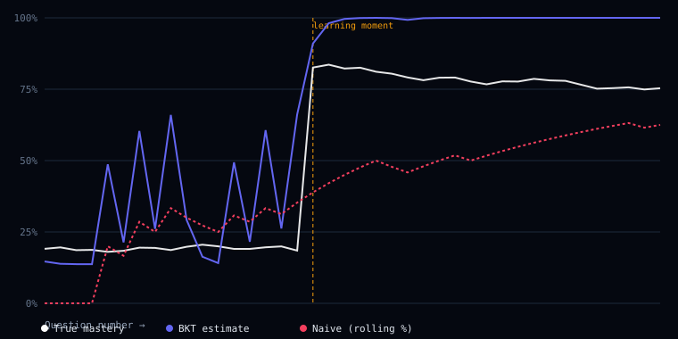

# Adaptive Tutor — Knowledge Tracing Agent

A web app that tracks per-topic student mastery using **Bayesian Knowledge
Tracing (BKT)** — a small, explainable probabilistic model — and uses an
LLM agent (Llama 3.3 70B via Groq's free tier, with Google AI / OpenRouter
fallbacks) purely to generate question/hint/explanation *text* once BKT
has decided what topic and difficulty come next.

**The split is intentional:** BKT makes the decision, the LLM generates the
language. Nothing in `server/bkt/` knows an LLM exists.

> Earlier versions of this README referenced Claude/Haiku, which is what
> the project used during early development before switching providers
> for free-tier rate limits. The architecture and division of labor are
> unchanged — only the text-generation backend swapped out.

## Phase 1 — BKT engine (this phase)

`server/bkt/bktEngine.js` is the entire decision-making core: four
parameters, two equations, zero dependencies.

- `pInit` — prior probability the student already knew the topic
- `pTransit` — probability of learning it during one practice opportunity
- `pGuess` — probability of a correct answer despite not knowing it
- `pSlip` — probability of an incorrect answer despite knowing it

Each call to `updateMastery(pMastery, correct, params)` does:
1. **Bayesian update** — revise p(mastery) using the observed answer
2. **Learning transit** — add the chance the student learned something
   during this opportunity

## Run the tests

```bash
npm install
npm test
```

11 unit tests cover: hand-verified posterior values (computed by hand
and checked against the code), directional correctness (mastery rises on
correct, falls on incorrect), convergence behavior over long sequences,
parameter sensitivity (guess/slip rates), and input validation.

## Phase 2 — Backend: Express + SQLite (this phase)

Adds persistence and a thin HTTP layer around the BKT engine. Still
**zero Claude calls** — `GET /api/session/next` returns the *decision*
(which topic, what difficulty) but no question text yet.

```
server/
├── config.js              # env vars
├── index.js                # express app entry
├── db/
│   ├── schema.sql          # 4 tables: users, topics, student_topic_mastery, attempts
│   ├── connection.js       # node:sqlite setup, applies schema.sql on boot
│   └── seedTopics.js       # seeds topics table from bkt/topics.js
├── bkt/
│   ├── bktEngine.js        # Phase 1 — unchanged
│   ├── bktEngine.test.js
│   └── topics.js           # topic list + default BKT params (programming fundamentals)
├── auth/
│   ├── passwords.js        # bcryptjs hash/verify
│   └── tokens.js           # JWT sign/verify
├── middleware/
│   └── requireAuth.js      # reads JWT cookie, attaches req.user
├── services/
│   └── topicSelector.js    # policy: weakest-topic-first + difficulty bands
└── routes/
    ├── auth.js              # POST /register, /login, /logout, GET /me
    ├── topics.js             # GET / (this student's topics + mastery)
    └── session.js            # GET /next, POST /answer — the BKT decision loop
```

**Storage note:** uses Node's built-in `node:sqlite` module (stable
from Node 22.5+) instead of the `better-sqlite3` npm package. Same
synchronous API, but zero native dependencies to compile — removes a
whole class of "doesn't build on the free-tier host" failure modes.
Requires Node ≥ 22.5.

### Run it

```bash
npm install
cp .env.example .env        # edit JWT_SECRET if you want
npm run dev                  # http://localhost:3001
```

```bash
# register a student
curl -c cookies.txt -X POST http://localhost:3001/api/auth/register \
  -H "Content-Type: application/json" \
  -d '{"email":"you@example.com","password":"a-real-password"}'

# see what's next
curl -b cookies.txt http://localhost:3001/api/session/next

# answer it
curl -b cookies.txt -X POST http://localhost:3001/api/session/answer \
  -H "Content-Type: application/json" \
  -d '{"topicId":1,"correct":true}'
```

## Phase 3 — The Claude agent (this phase)

Adds the actual question/hint/explanation text, generated by Claude
Haiku — strictly downstream of the BKT decision, never influencing it.

```
server/agent/
├── questionSchema.js       # the JSON contract + a strict validator
├── questionSchema.test.js
├── promptTemplates.js      # the tool definition + system/user prompts
├── mockClaude.js           # dev-mode generator, same contract as the real one
├── mockClaude.test.js      # proves mock and real share one contract
├── claudeClient.js         # real Claude API call (forced tool-calling)
└── generateQuestion.js     # the one entry point — switches mock/live
```

**How question generation works:**

1. `topicSelector.js` (unchanged from Phase 2) decides *which* topic
   and *what difficulty* — pure data, zero Claude involvement.
2. `generateQuestion()` is the only function the rest of the app calls.
   It reads `CLAUDE_MODE` and dispatches to either `mockClaude.js`
   (default, zero API calls) or `claudeClient.js` (real Haiku call).
3. Both paths return the exact same shape, enforced by
   `validateQuestionShape()` — the rest of the app never knows or
   cares which one ran.
4. `claudeClient.js` **forces tool-calling** rather than asking Claude
   to free-write JSON: Claude must call a `generate_question` tool
   with a fixed input schema, so the response arrives as already-
   structured data. (Not using the newer "Structured Outputs" beta
   feature here — it doesn't yet reliably cover Haiku 4.5.)

**Security note — the API contract changed from Phase 2:**
`POST /api/session/answer` no longer accepts `correct: boolean`
directly (that was always a placeholder). The correct answer and
explanation are generated once, stored server-side in a new
`active_questions` table, and never sent to the client until *after*
grading. The client only ever sends which option it picked
(`selectedOptionIndex`); the server determines correctness.

`GET /api/session/next` is idempotent: if the student already has an
unanswered question, it's returned as-is instead of generating a new
one — this avoids burning a Claude call on every page refresh.

### Run it (still mock mode by default — zero API calls)

```bash
npm install
cp .env.example .env
npm run dev
```

```bash
curl -c cookies.txt -X POST http://localhost:3001/api/auth/register \
  -H "Content-Type: application/json" \
  -d '{"email":"you@example.com","password":"a-real-password","preferredLanguage":"javascript"}'

curl -b cookies.txt http://localhost:3001/api/session/next
# -> { ..., "question": "[MOCK] ...", "options": [...], "hint": "..." }
#    note: no correctOptionIndex or explanation yet

curl -b cookies.txt -X POST http://localhost:3001/api/session/answer \
  -H "Content-Type: application/json" \
  -d '{"topicId":1,"selectedOptionIndex":1}'
# -> now includes "correct", "correctOptionIndex", and "explanation"
```

### Flipping on real Claude calls

Once the mocked path is fully working, set in `.env`:

```
CLAUDE_MODE=live
ANTHROPIC_API_KEY=sk-ant-...
```

No code changes needed — `generateQuestion()` picks it up automatically.

## Phase 5 — Evaluation

The strongest evidence that BKT is doing real work: a synthetic-student
simulation that scores it against a naive "rolling percent-correct"
baseline — the tracker most simple quiz apps actually ship.

```bash
npm run evaluate
```

This simulates 100 synthetic students answering 40 questions each. Each
student has a hidden "true mastery" that itself evolves over time,
including one deliberate "learning moment" partway through the sequence
(simulating a student who actually studied). Both trackers watch the
same noisy answer stream; we then measure how closely each one's belief
matches the hidden ground truth.

```
Metric                              BKT        Naive (rolling %)
-----------------------------------------------------------------
Mean Absolute Error (overall)        21.44%     26.76%
Mean Absolute Error (after learning)  19.95%     32.82%
Avg. questions to detect ability jump 5.7        21.9
-----------------------------------------------------------------
BKT is 19.9% more accurate overall than the naive baseline.
BKT detects a real ability change 16.2 questions faster on average.
```

(Numbers are reproducible — the simulation uses a seeded PRNG.)



The chart shows one student's trace: true hidden mastery (white), BKT's
estimate (indigo), and the naive baseline (dashed rose). BKT snaps to the
post-learning-moment true mastery in a handful of questions; the naive
tracker drags for a long stretch because it can't distinguish "genuinely
got better" from "got lucky a few times in a row."

Run `npm run evaluate` again any time — it regenerates
`server/evaluation/results.csv` (raw per-step trace) and
`server/evaluation/calibration.svg`.

## Status

- [x] Phase 1 — BKT engine (pure math, fully tested)
- [x] Phase 2 — Backend: Express + SQLite + auth + topic routing
- [x] Phase 3 — LLM agent (mocked by default, real calls behind `LLM_PROVIDER=groq`)
- [x] Phase 4 — React frontend (dark-mode quiz UI, mastery dashboard, activity heatmap)
- [x] Phase 5 — Evaluation (synthetic-student simulation vs. naive baseline, see above)
